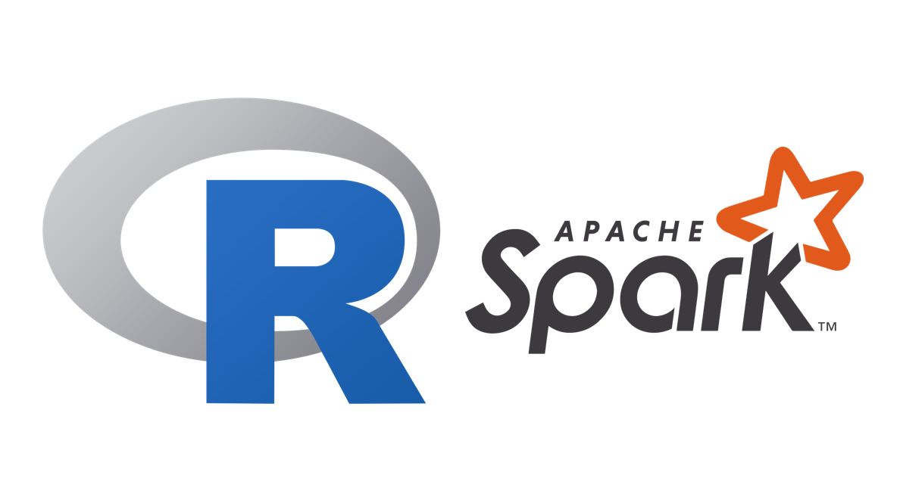

# SparkR Demo

Welcome to the SparkR Sample Codes repository! This repository provides a collection of sample codes and scripts to help you get started with SparkR, the R interface for Apache Spark. SparkR allows you to analyze large datasets and perform distributed computing using the familiar R programming language.

## Getting Started

This repository is structured to provide simple and complex examples of using SparkR to perform data analysis and machine learning tasks in a distributed computing environment. Whether you're a beginner or an experienced R user, these examples will help you understand how to leverage Spark’s power in R.

## Prerequisites

To run these examples, you'll need:

 - R (version 3.5 or above recommended)
 - Apache Spark (version 2.4 or above recommended)
 - Intermediate knowledge of R programming
 - Familiarity with Spark concepts (optional, but helpful)

## Usage

Each sample code demonstrates a different SparkR feature or workflow. Here’s an overview:

 - DataFrame Operations: Demonstrates how to create Spark DataFrames, perform transformations, and execute actions.
 - Data Manipulation: Shows examples of data wrangling, filtering, and aggregations using SparkR.
 - Machine Learning: Implements basic machine learning algorithms like linear regression, logistic regression, and clustering using Spark’s MLlib.
 - Spark SQL: Illustrates how to use Spark SQL in SparkR for querying and analyzing data.
 - Streaming: Provides a simple example of processing streaming data in SparkR.

## Contributing

Contributions are welcome! If you'd like to add new examples or improve the existing ones, feel free to fork this repository, make your changes, and submit a pull request. Make sure your code follows the repository's style and is well-documented.
